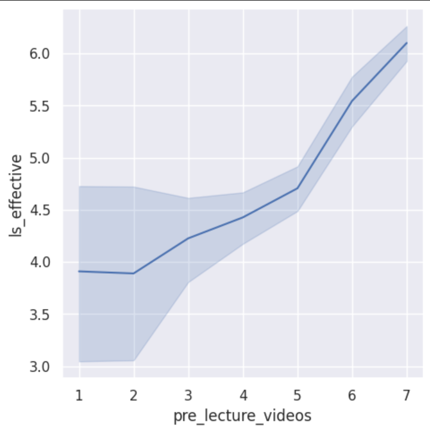
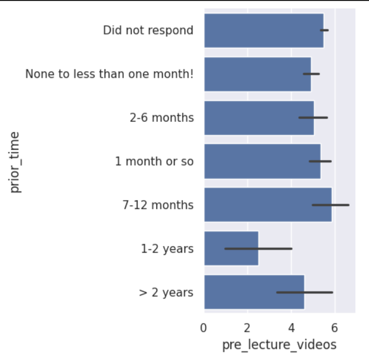
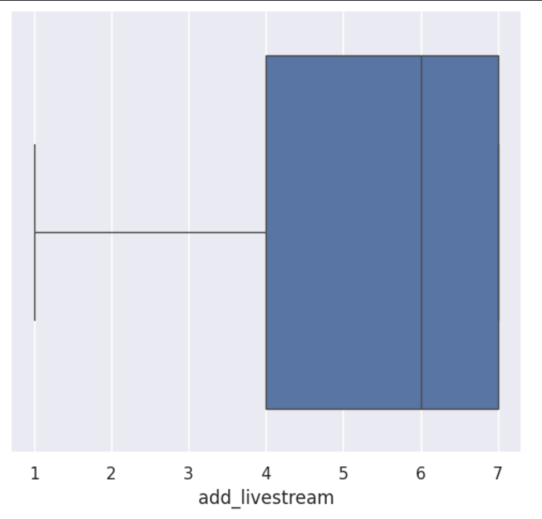

---
# Do not edit the text between these lines!
layout: default
---

# COMP110 EX09 Class Survey Analysis!

<!-- This is a comment. Below, you'll see code for inserting an image. To make this image appear, update <custom-path>. To add an image, save it inside the imgs folder of this repository. -->

## Summary

After implementing defined functions that were created both in-class and on our own, we were able to read the csv files of our course's class survey and analyze its findings. After brainstorming ideas on what could be supported/refuted by the class data, I was able to investigate what the possible evidence in support of the idea of: "The course should include more recorded material because it will allow for more useable/accessible resources for students enrolled." To explore the data, I utilized a custom helper function designed by myself, a lineplot, a barplot, and a boxplot. In the end, I interpreted my findings and resolved to evaluate whether these results supported/countered my idea.

## Visualizations

**Line Plot**  

  

Here, we can see a positive relationship between finding lecture videos effective and recommending pre lecture videos. In addition, the plot shows that students who recommend pre lecture videos more, also find lecture videos more effective.  

**Bar Plot**  

  

From this barplot, we can observe that people with 1-2 years of prior self-guided learning tend to recommend the implementation of pre-lecture videos less. Whilst those with lower experience, tend to recommend the implementation of pre-lecture videos more highly. Surprisingly, those with 7-12 months tend to recommend pre-lecture videos the most out of all responses.    

**Box Plot**  

  

From our boxplot, we can observe a high median value of around 6. In addition, we can also note a noticeable skew towards higher values. Interpreting this, we can find that students generally favored the idea of including livestream lectures in substitution of required in-person attendance.  

## Conclusions

Ultimately, evidence found in Izzi's section of the course revealed support towards the idea of more recorded material available in the course. Starting with majority responses in our count analysis, we found that the majority of people strongly agreed (as evident of a response of 7) with the ideas of pre-lecture videos, lecture video effectiveness, and opting for livestream videos. In addition, we also found that the ruling class of students possessed minimal time spent in self-directed programming learning. Through our visualizations of a lineplot, barplot, and boxplot, we determined three findings:  
- Those who found lecture videos effective, also recommended pre-lecture videos  
- Typically, those of lower time spent in self-directed programming learning also recommended pre-lecture videos  
- Students generally favored the inclusion of livestreamed lectures in substitution of required in-person attendance  
  
Overall, I recommend that the course include more recorded material to better assist with students in learning the course topics. One extension to this idea could be reusing videos to save on time spent creating new ones. As for tradeoffs, when it comes to livestreaming the lectures, the instructional staff will definitely experience the lack of in-person attendance. In addition, the idea of recorded material may cause students enrolled to slack-off or even procrastinate.

